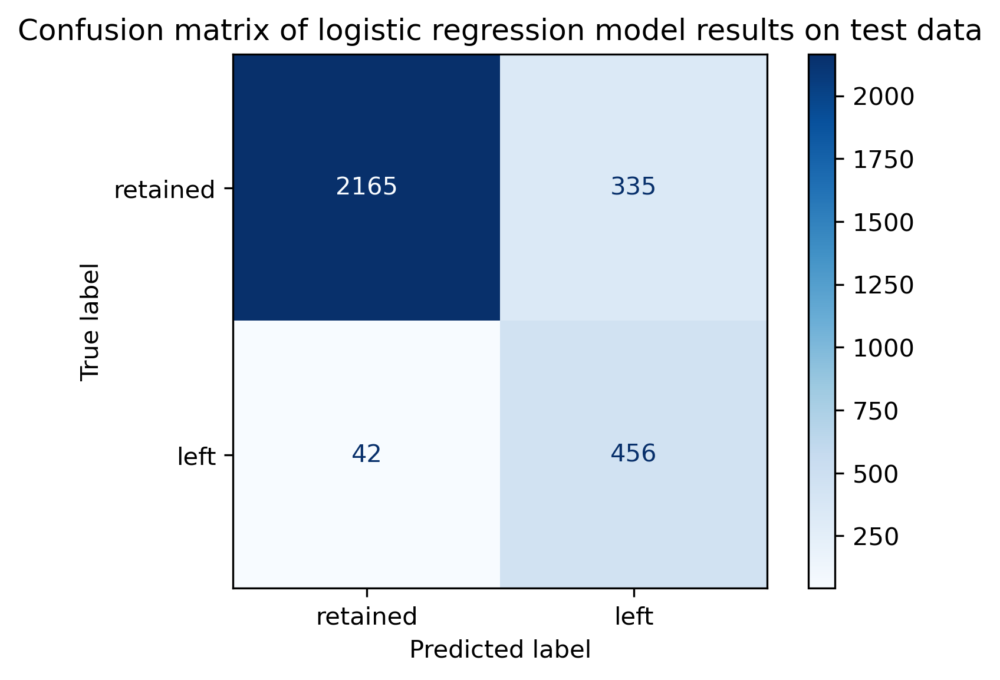
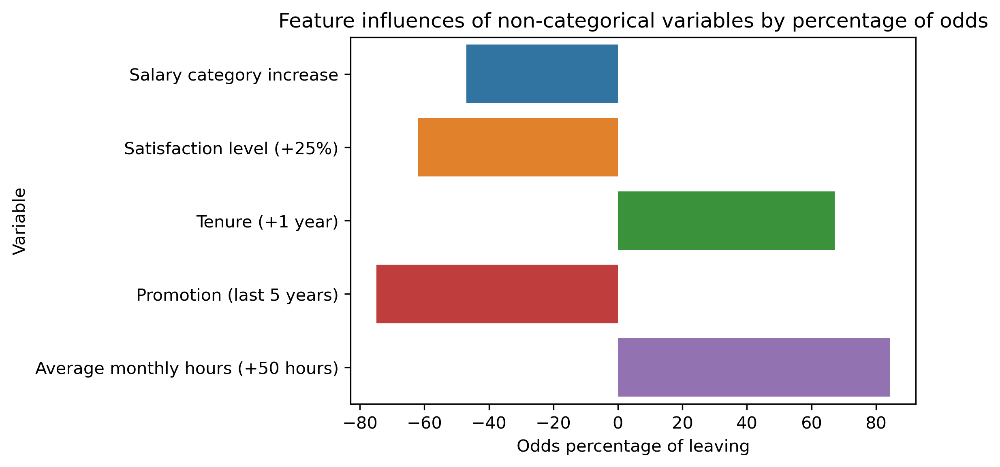
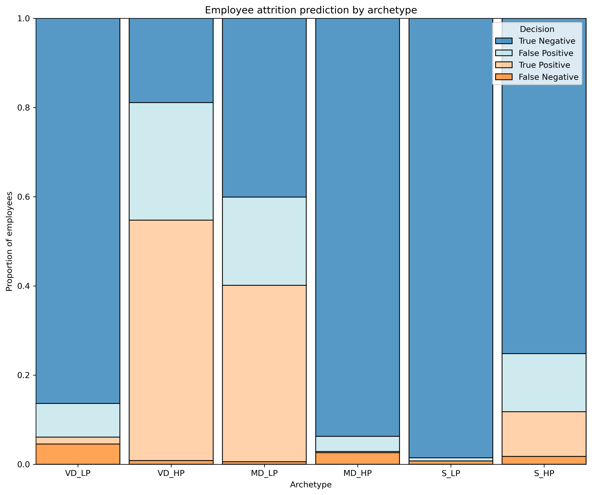

# Analyzing and Predicting Employee Turnover with Logistic Regression

## Overview

The goal of this project was to understand the factors driving employee attrition at Salifort Motors, an imaginary French company specializing in alternative engines.

To achieve this, I used EDA (Exploratory Data Analytics) with Python, built a logistic regression model, and applied threshold optimization to improve predictive power.

This work enabled me to:
- Reveal strong attrition drivers such as such as workload imbalance, and limited performance-based rewards;
- Uncover 6 archetypes* among workers, each describing a unique attrition pattern;
- Build a predictive model that reduces by 73% the risk of an employee leaving without early detection.

## Abilities
- [x] Understanding business context
- [x] Project proposal writing
- [x] Python: pandas, numpy, matplotlib, seaborn, scikit-learn, statsmodels, scipy
- [x] Exploratory Data Analysis (EDA): data cleaning, transformations, anomaly detection
- [x] Data visualization
- [x] Feature engineering
- [x] Statistical testing (Chi-squared)
- [x] Model design: selecting algorithms and exaluation strategies
- [x] Logistic regression modeling: assumptions, training, validation
- [x] Model evaluation: precision, recall, F-scores, ROC/AUC, accuracy
- [x] Threshold optimization for business-aligned decision-making
- [x] Executive-level reporting and synthesis

## Business understanding

Stakeholders: Senior leadership, HR team

This company is experiencing a high employee turnover, which leads to productivity loss, knowledge drain, and increased recruitment costs. Senior leadership and the HR team seek actionable insights to improve employee well-being and reduce attrition. Moreover, they also wish to identify employees at risk of leaving and to better understand the factors driving their decisions.

## Data understanding and limitations

- The dataset initially contained nearly 15,000 entries, but about 20% were duplicates, leaving 11,991 unique employee records for analysis.
- Variables included satisfaction level, evaluation score, workload, salary tier, promotion history, and tenure.
- The dataset lacks demographic or qualitative information, which limits the possible depth of interpretation.
- Several feature categories had very low frequencies (e.g., promotions, work accidents).
- The attrition label is imbalanced (only 16.6% of employees left) and required careful modeling.
- The data is described as coming from "an HR survey", but we dlack information on collection methodology, response rates, or data validation (20% duplicate rows suggests possible data quality issues).
- There is no temporal information indicating when satisfaction levels or evaluations were measured relative to employee departure, making it diffcult to interpret causality.
- EDA revealed synthetic patterns in the data, meaning the dataset may be partially artificial, and conclusions may not generalize to real-world HR contexts.

**The 6 archetypes stories**
- VD_LP: Very dissatisfied, low performance. Disengaged and not performing well. They often stay despite satisfaction.
- VD_HP: Very dissatisfied, high performance. They deliver strong results, but feel overloaded, under-recognized or burned out. They leave at an alarming rate.
- MD_LP: Moderately dissatisfied, low performance. Under-stimulated or under-used, they have fewer projects and fewer hours. Their attrition rate is very high.
- MD_HP: Moderately dissatisfied, high performance. Good performers but they encounter mild discomfort about some aspects of their jobs. The majority of them won't leave.
- S_LP: Satisfied or very satisfied, low performance. Their fine with the job as it is, but their contribution isn't optimal. They tend to stay.
- S_HP: Satisfied or very satisfied, high performance. Often senior people who may leave for better opportunities, lighter workload, or career change. Surprisingly high departure rates despite satisfaction.

## Modeling and evaluation

The model selected for this binary classification task was a logistic regression model, because it offers better interpretability, stability, and is more suitable to explain drivers of attrition.

Performance was evaluated using standard baseline metrics: accuracy, precision, recall, F1 score, and ROC/AUC.

Because the business objective is to avoid losing employees without warning, a cost-based analysis was conducted to prioritize recall over other metrics. To reflect this, the model was optimized using the F2 score. This process identified an optimal threshold of 0.18.

The final model reduces false negatives by around 73% compared to a standard non-optimized logistic regression model, leaving only 8% of departures undetected. This improvement requires HR to follow up on around 26% of employees.

## Conclusion and recommendations

- Attrition appears to be strongly driven by workload imbalance, lack of recognition and extreme overtime.
- Salary increases, promotions and higher satisfaction overall significantly reduces departures.
- Model can help detect early risk of leaving and retain valuable high-performance groups.

**Recommendations:**
- Maintain, if possible, the workload between 3-5 projects per employee.
- Watch employees handling too few or too many projects, as this is a clear pattern for departures.
- Expand recognition and promotion to reward performance fairly.
- Use the model for proactive HR monitoring.

**Future possible steps:**
- Test more advanced models (Random Forest, XGBoost) to compare performance.
- Add more relevant data to enhance interpretation.
